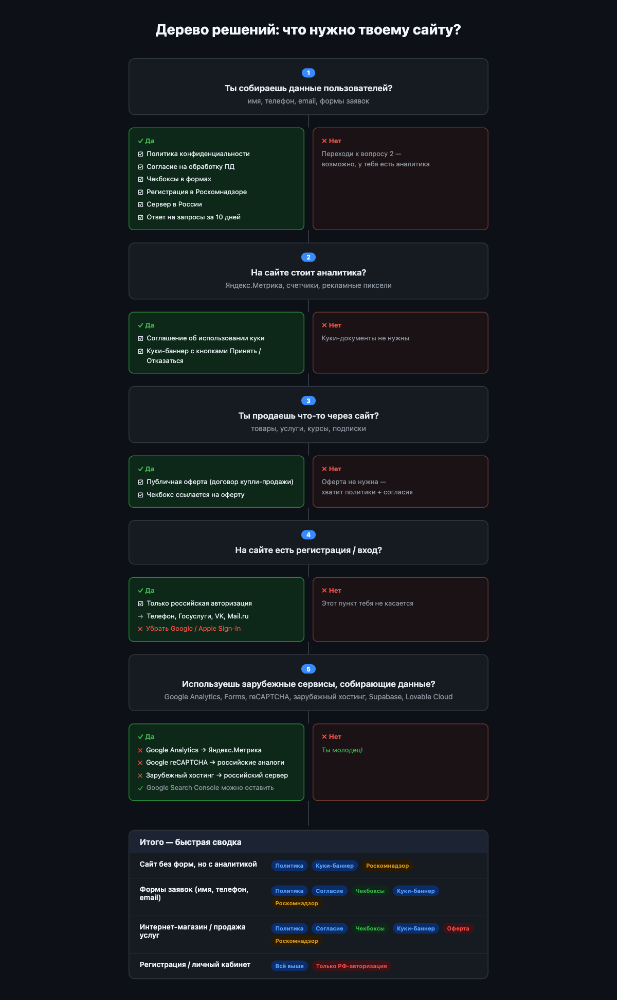

# Соответствие российскому закону о персональных данных (152-ФЗ)

> На основе видео: https://www.youtube.com/watch?v=c9rBxIKFiow

## TL;DR

Если у тебя есть сайт и ты собираешь хоть какие-то данные пользователей (имя, телефон, email, даже просто куки) — ты обязан:

1. **Повесить 3 документа в футер сайта** — политику конфиденциальности, согласие на обработку ПД и соглашение о куки
2. **Добавить чекбоксы в формы** — без галочек форма не отправляется, галочки не предзаполнены, ссылки кликабельны
3. **Показать куки-баннер** — плашка при первом заходе с кнопками "Принять" / "Отказаться"
4. **Хранить данные на серверах в России** — никаких Supabase/Lovable Cloud по умолчанию, убрать Google Analytics/Forms/reCAPTCHA
5. **Авторизация только через российские сервисы** — телефон, Госуслуги, VK, Mail.ru (без Google/Apple)
6. **Отвечать на запросы пользователей за 10 дней** — удалять данные по первому требованию
7. **Зарегистрироваться в Роскомнадзоре** — без этого любая обработка данных незаконна

**Не сделаешь — штрафы от 10 000 до 18 000 000 руб., а за утечки — до 3% годовой выручки и уголовка.**

---

## Дерево решений — что нужно именно тебе?

Ответь на 5 вопросов и собери свой набор обязательных действий.

---

## 1. Обязательные документы на сайте

### 1.1 Политика конфиденциальности

Размещается в футере сайта со ссылкой на отдельную страницу. Должна содержать:

- Название компании, ИНН, ОГРН
- Какие данные вы собираете (имя, телефон, email, IP-адрес, куки и т.д.)
- Зачем вы их собираете (цель)
- На каком основании собираете
- Как защищаете данные
- Кому передаете
- Сколько храните
- Как пользователь может удалить свои данные

**Штраф за отсутствие политики конфиденциальности:** 10 000-20 000 руб. (ИП), 30 000-60 000 руб. (компании)

### 1.2 Согласие на обработку персональных данных

Отдельный документ (НЕ объединять с политикой конфиденциальности). Содержит:

- Название компании, ИНН, ОГРН
- Какие данные обрабатываются (имя, телефон, email и т.д.)
- Цель обработки (обработка заявок, отправка рассылки, исполнение договора и т.д.)
- Как пользователь может отозвать согласие (указать email для связи)

Размещается в футере сайта рядом с политикой конфиденциальности.

### 1.3 Соглашение об использовании куки

Требуется, если на сайте установлены Яндекс.Метрика, любые счетчики аналитики, рекламные пиксели, виджеты, собирающие данные и т.п. Два варианта размещения:

- Отдельный документ со ссылкой в футере, ИЛИ
- Раздел внутри политики конфиденциальности (со ссылкой на него)

**Куки-баннер:** При первом заходе на сайт должно появляться уведомление об использовании куки-файлов. Пользователю необходимо предоставить возможность отказаться. При отказе аналитические скрипты (Яндекс.Метрика и т.д.) не должны загружаться, куки не должны сохраняться.

**Штраф за отсутствие куки-баннера:** 30 000-300 000 руб.

---

## 2. Настройка форм на сайте

### 2.1 Обычная форма заявки (имя, телефон, email)

Два обязательных чекбокса перед кнопкой "Отправить":

1. **Чекбокс 1:** "Даю согласие на обработку моих персональных данных" (ссылка на Согласие) + "Ознакомиться с политикой обработки персональных данных можно здесь" (ссылка на Политику конфиденциальности)
2. **Чекбокс 2:** "Даю согласие на получение рассылки/рекламных информационных материалов"

Правила:
- Галочки НЕ должны стоять по умолчанию
- Ссылки в тексте чекбоксов должны быть кликабельными и вести на соответствующие документы
- Форма НЕ должна отправляться без проставленных галочек

### 2.2 Форма с оплатой / регистрацией (интернет-магазин)

Вместо согласия используется **Публичная оферта** — договор купли-продажи, который должен содержать:

- Данные продавца: название, ИНН, ОГРН, адрес, контакты
- Описание товара или услуги
- Полная цена, включая все обязательные платежи
- Порядок оплаты
- Порядок доставки (сроки, стоимость, способы)
- Условия возврата товара (обязательно)
- Информация о гарантии (если есть)
- Ответственности сторон
- Политика обработки персональных данных

Оферта размещается в футере сайта. Первый чекбокс ссылается на оферту + политику конфиденциальности, второй — на согласие с рассылкой.

### 2.3 Форма подписки (только email)

Нужен только один чекбокс: согласие на получение рассылки. Если собираете ещё и имя — нужны оба чекбокса.

**Штрафы за отсутствие чекбоксов:** 300 000-700 000 руб. (первое нарушение), 500 000-1 500 000 руб. (повторное нарушение)

---

## 3. Локализация данных — серверы должны быть в России

**Если вы собираете данные граждан России, сервер ОБЯЗАТЕЛЬНО должен находиться в России.** Это требование 152-ФЗ.

### Что нужно сделать:
- Перенести базу данных на российский сервер (например, мигрировать Supabase на российский хостинг)
- НЕ использовать Lovable Cloud или стандартный Supabase (иностранные серверы)
- Удалить Google Analytics — заменить на Яндекс.Метрику
- Удалить Google Forms
- Удалить Google reCAPTCHA
- Удалить все сервисы Google, которые собирают данные пользователей
- Google Search Console можно оставить (не собирает персональные данные)

### Штрафы за нарушение локализации:

| Нарушение | Минимум | Максимум | Средний |
|-----------|---------|----------|---------|
| Первое нарушение | 500 000 руб. | 4 000 000 руб. | 1 500 000 руб. |
| Повторное нарушение | 3 000 000 руб. | 18 000 000 руб. | 10 500 000 руб. |

---

## 4. Авторизация — только российские сервисы

Если на сайте есть регистрация/вход, необходимо использовать только российские способы авторизации:

- Российский номер телефона
- Госуслуги
- Mail.ru
- ВКонтакте (VK)

**НЕ использовать** вход через Google или Apple.

**Штрафы:** до 700 000 руб. (первое нарушение), до 1 500 000 руб. (повторное нарушение)

---

## 5. Обработка запросов пользователей

Пользователь имеет право:
- Узнать, какие его данные вы храните
- Потребовать исправить неточные данные
- Потребовать удалить его данные

### Требования:
- Указать контактный email в политике конфиденциальности
- Ответить на запрос в течение **10 дней**
- При запросе на удаление — удалить данные из ВСЕХ систем (CRM, рассылки, базы данных и т.д.)

**Штрафы за игнорирование запросов:** 20 000-40 000 руб. (ИП), 50 000-90 000 руб. (компании, первое нарушение), 300 000-500 000 руб. (компании, повторное нарушение)

---

## 6. Штрафы за утечку персональных данных

| Масштаб утечки | Штраф |
|----------------|-------|
| ~1 000 человек | 3 000 000-5 000 000 руб. |
| ~10 000 человек | 5 000 000-10 000 000 руб. |
| ~100 000 человек | 10 000 000-15 000 000 руб. |
| Повторная утечка | 1-3% годовой выручки (минимум 20 000 000 руб.) |
| Неуведомление Роскомнадзора | дополнительно 1 000 000-3 000 000 руб. |

**Специальные категории ПД** (медицинские данные, сведения об интимной жизни, политических взглядах, религиозных и философских убеждениях) — утечка грозит не только штрафами, но и исками от пострадавших субъектов ПД, а также уголовной ответственностью.

---

## 7. Регистрация в Роскомнадзоре

**Это обязательно.** Без регистрации вы незаконно обрабатываете данные.

**Штраф за отсутствие регистрации:** 100 000-300 000 руб.

### Что заполнять в заявке:

1. **Регион обработки** — рекомендуется указывать "Вся Россия"; если есть физические офисы/филиалы в конкретных регионах, перечислить их отдельно
2. **Цели обработки ПД** — выбрать все подходящие из ~30 вариантов:
   - Сбор заявок с сайта
   - Обратная связь с пользователями
   - Кадровый учет (если есть сотрудники)
   - Исполнение договора (если продаете товары/услуги)
   - Статистика и аналитика
   - и т.д.
   - **Цели должны на 100% совпадать с политикой конфиденциальности** (Роскомнадзор это проверяет)
3. **Данные хостинг-провайдера** — название компании, ИНН, ОГРН, юридический адрес. Если несколько мест хранения — указать все.
4. **Трансграничная передача данных** — если используете ЛЮБЫЕ иностранные сервисы, собирающие данные (Google Analytics, зарубежный хостинг и т.д.), это считается трансграничной передачей. **Удалите все зарубежные сервисы до подачи заявки.**

---

## Чек-лист

- [ ] Политика конфиденциальности создана и размещена в футере
- [ ] Согласие на обработку ПД создано и размещено в футере
- [ ] Соглашение об использовании куки создано (отдельный документ или раздел в политике)
- [ ] Куки-баннер появляется при первом посещении с возможностью принять/отказаться
- [ ] Все формы содержат обязательные чекбоксы (не отмечены по умолчанию)
- [ ] Чекбоксы содержат кликабельные ссылки на документы
- [ ] Формы не отправляются без проставленных галочек
- [ ] Публичная оферта создана (для интернет-магазина)
- [ ] Сервер/база данных находится в России
- [ ] Google Analytics удалена, заменена на Яндекс.Метрику
- [ ] Google Forms, reCAPTCHA и другие сервисы Google, собирающие данные, удалены
- [ ] Авторизация только через российские сервисы (без Google/Apple)
- [ ] Контактный email для запросов по ПД указан в политике конфиденциальности
- [ ] Настроен процесс ответа на запросы пользователей в течение 10 дней
- [ ] Зарегистрированы в Роскомнадзоре
- [ ] Цели в заявке Роскомнадзора совпадают с политикой конфиденциальности
- [ ] Все хостинг-провайдеры указаны в заявке Роскомнадзора
- [ ] Нет трансграничной передачи данных (или она правильно задекларирована)
